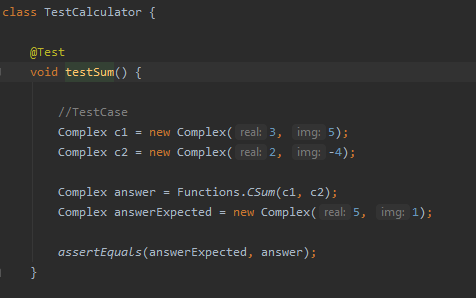
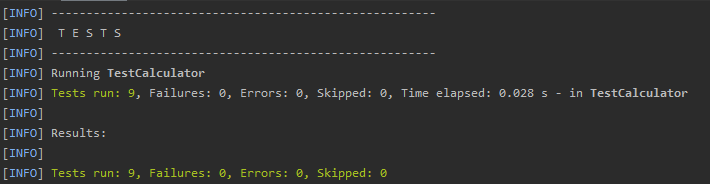

# ComplexCalculator - LAB1 CNYT

Calculadora capaz de realizar las operaciones básicas sobre números complejos.

## Para empezar

Estas instrucciones le proporcionarán una copia del proyecto en funcionamiento en su máquina local para fines de desarrollo y pruebas.

### Prerrequisitos

Qué cosas necesitas para instalar el Software:

- Maven
- Java 8+


### Instalando y corriendo

A continuación veras los pasos a seguir para la instalación del software

1. Clona el proyecto en tu maquina.

```
git clone https://github.com/SebastianGoenaga/ComplexCalculator

```

2. Entra al directorio recién clonado.

3. Ejecuta los siguientes comandos:
	- Compila nuestro código. De los .java genera los .class.  
    `mvn compile`
	-   Compila las pruebas.  
    `mvn test-compile`
	-   Ejecuta las pruebas.  
    `mvn test`

### Ingresar casos de prueba
El siguiente archivo es el que se modificará.
`\ComplexCalculator\src\test\java\TestCalculator.java`

En el caso `de testSum` debes modificar los complejos a sumar que están indicados por el comentario `//TestCase`, y luego modificar la variable `answareExpected` por el complejo esperado.


Del mismo modo es posible modificar cualquier caso de prueba para corroborar la efectividad del programa.

El resultado al finalizar y ejecutar nuevamente los comandos anteriormente indicados para ejecutar las pruebas, el resultado deberá ser el siguiente:




## Authors

-   **Sebastián Goenaga**  -  _Initial work_  -  [ComplexCalculator](https://github.com/SebastianGoenaga/ComplexCalculator)

## License

This project is licensed under the MIT License - see the  [LICENSE.md](https://github.com/SebastianGoenaga/ComplexCalculator/blob/master/LICENSE)  file for details